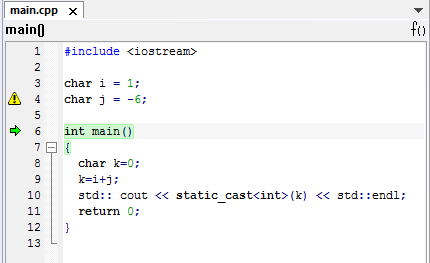
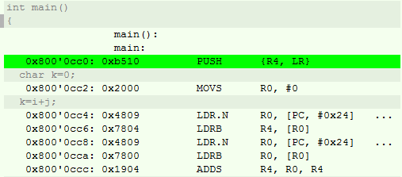
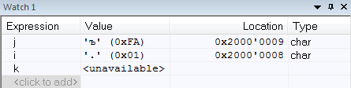
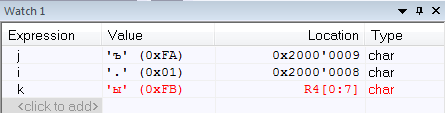
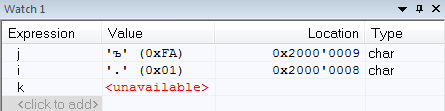
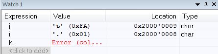
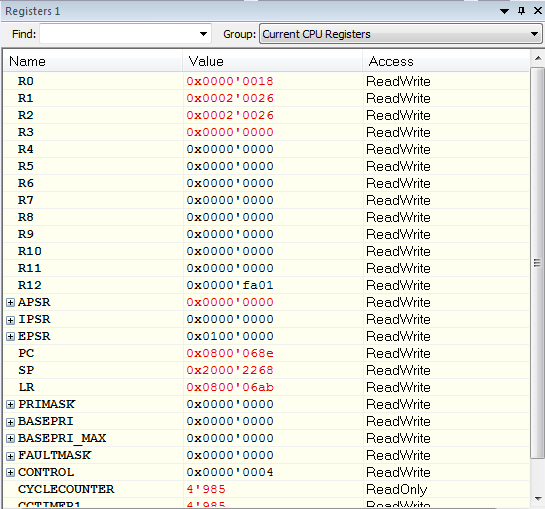
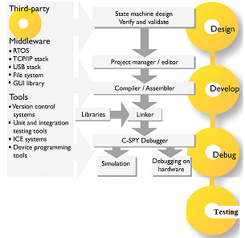

:figure-caption: Рисунок

= Лабораторная №1

== Задание
Создать проект под микроконтроллер *STM32F411RE* в IDE *IAR Embedded Workbench*, затем написать код программы, которая считает сумму двух *char* чисел (например *1* и *-6*).

== Программа

Напишем программу которая считает сумму двух char чисел, попробовать сложить несколько разных числе скажем 1 и -6. Выведем результат в Terminal I/O.

.Программа, которая считает сумму двух char чисел

== Terminal I/O
.Окно терминала
image::2.PNG[400, 400]

Переменная char вмещает 256 символов -- от 0 до 255.
1 + (-6) = -5 -- в переменной char такого числа нет и она уменьшается с конца (получим число 251).

== Запуск проекта в режим симуляции
Запустим проект на выполнение под симулятором и посмотрим листинг дизамблера.

.Окно Disassembly

Выделенная строка показывает текущую исполняющую кода и команду ассемблера.

== Окно Watch
Проверим все переменные в окне watch, сделаем пошаговую отладку (F10, F11) и посмотрим, как меняются переменные в окне Watch. заупустить окно Resisters и посмотрим значения регистров в которых созданы переменные.

.Изменения переменныых в окне Watch

== Окно Registers
.Окно Registers 1

В окне Registers можно просматривать значения регистров в которых созданы переменные (если они там созданы)

== Вопросы по разделу
[qanda]
*Дайте определение понятию “Интегрированной среде разработки”*::
Ответ: Ответ: Интегри́рованная среда́ разрабо́тки, ИСP (англ. Integrated development environment — IDE), также единая среда разработки, ЕСР — комплекс программных средств, используемый программистами для разработки программного обеспечения (ПО).

*Что такое компилятор и чем он отличается от транслятора?*::
Ответ:Компилятор – это транслятор, который осуществляет перевод исходной программы в эквивалентную ей объектную программу на языке машинных команд или на языке ассемблера. Компилятор отличается от транслятора лишь тем, что его результирующая программа всегда должна быть написана на языке машинных кодов или на языке ассемблера.

*Что такое компоновщик и какие функции он выполняет?*::
Ответ: Компоновщик (или редактор связей) предназначен для связывания между собой объектных файлов, порождаемых компилятором, а также файлов библиотек, входящих в состав системы программирования.
+
Функция компоновщика достаточно проста. Он начинает свою работу с того, что выбирает из первого объектного модуля программную секцию и присваивает ей начальный адрес. Программные секции остальных объектных модулей получают адреса относительно начального адреса в порядке следования. При этом может выполняться также функция выравнивания начальных адресов программных секций. Одновременно с объединением текстов программных секций объединяются секции данных, таблицы идентификаторов и внешних имен. Разрешаются межсекционные ссылки.

*Почему важен процесс проектирования ПО какие задачи входят в этот процесс?*::
Ответ:
+
Проектируя ПО, разработчик получает возможность: оценить  время и стоимость разработки ПО; определить необходимые этапы действия, разбить задачи на более мелкие, что в дальнейшем экономит время; автоматизировать часть разработки; избежать разногласий и неудовлетворённости заказчика и исполнителя.
+
Проектирование ведется поэтапно в соответствии со стадиями : Техническое задание; Техническое предложение; Эскизный проект; Технический проект; Рабочий проект.

*Дорисуйте процесс разработки ПО, описанный на изображении <<IAR_Workbench>> с учетом итеративности связей в этом процессе*::
Ответ:
+

*Зачем нужна отладка и в каких случаях она применяется? Для чего применяются точки остановки?*::
Ответ: Отладкой - выявление и устранение причин неправильной рабо-ты программы. Необходимость проведения отладки возникает при обнаружении ошибок при тестировании. Отладку всегда придется проводить автору программы. Рекомендуют применять индуктивный и дедуктивный подходы к отладке.
+
Если не удается найти причину неправильной работы то ставят точки остановки. С помощью них обычно указывается место, где произошла ошибка. Причиной чаще всего являются некорректные данные для этой операции и/или их отсутствие. При останове на этой  точке просматривается значения участвующих в программе, и ищется ошибка.

*Какие еще важные IAR workbench можно добавить в таблицу <<Характеристики IAR>>*::
Ответ: возможность работы с многими микроконтроллерами большого числа производителей; постоянное добавление новых микроконтроллеров; возможность самостоятельного управления оптимизацией отдельных модулей проекта;
