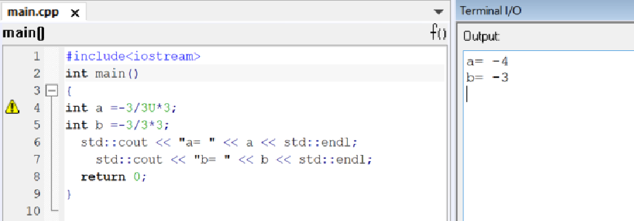
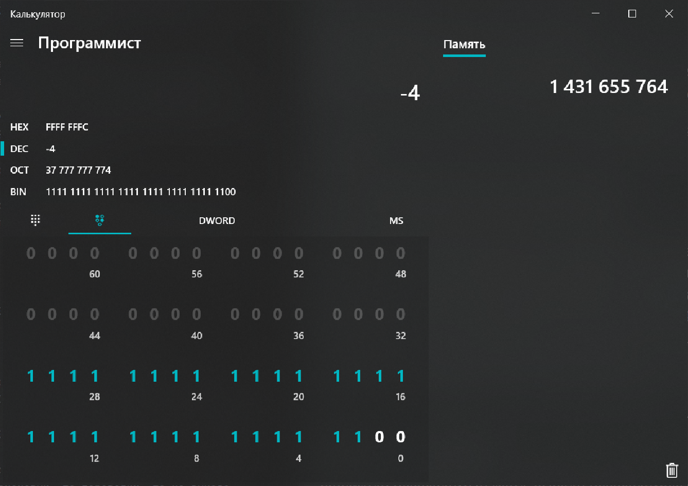
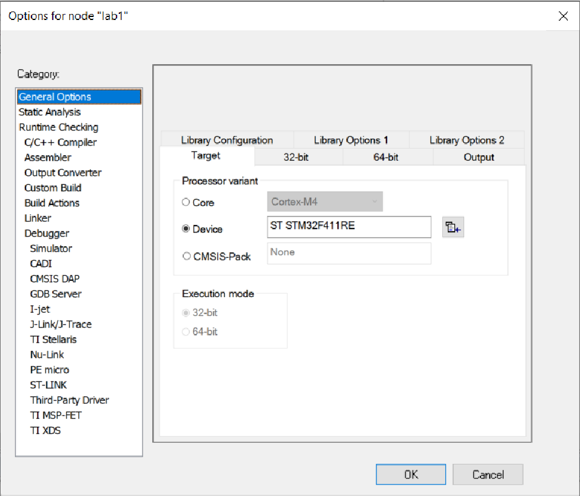
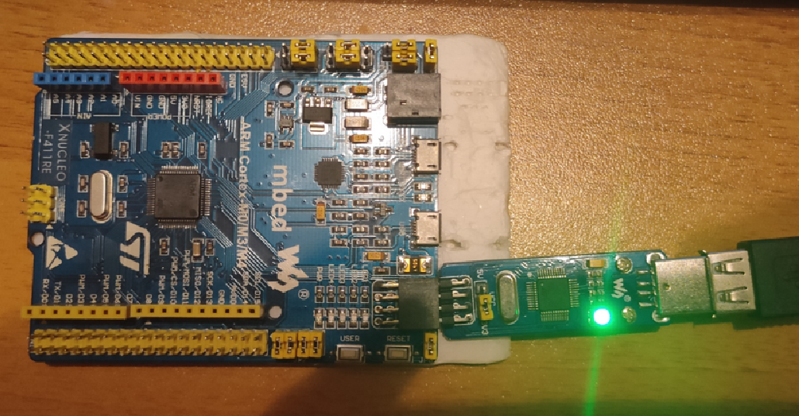

= Лабораторная №1

== Задание
* Написать программу вычисляющую следующее выражение -3/3U *3 ,удивиться увиденному и объяснить результат.
* Подключить плату к своему домашнему компу, проверить что все работает, плата прошивается и все работает как в аптеке.
* Запустить на плате Lab1 из https://githubcom/lamer0k/stm32Labs/tree/master/Lab1
Пронаблюдать, что произошло на плате, все сфоткать.
* Сделать отчет с описание удивительных вещей из пункта а) и пошаговой работы с платой, с картинками, оглавлением, кодом и всяким модным и современным форматированием, чтобы отчет был читабельным и восхитительным. Описать ошибки которые вы получали при настройки, объяснить, что за ошибки, почему они возникли и как вы их исправили.

== Работа с программой
Пишем заданную программу и получаем следующий результат.

"*Проявляем удивление*"

int: представляет целое число. В зависимости от архитектуры процессора может занимать 2 байта (16 бит) или 4 байта (32 бита). Диапазонпредельных значений соответственно также может варьироваться от –32768 до 32767 (при 2 байтах) или от −2 147 483 648 до 2 147 483 647 (при 4 байтах).

unsigned int: представляет положительное целое число. В зависимости от архитектуры процессора может занимать 2 байта (16 бит) или 4 байта (32 бита), и из-за этого диапазон предельных значений может меняться: от 0 до 65535 (для 2 байт), либо от 0 до 4 294 967 295 (для 4 байт).

Данный микроконтроллер 32-х битный.

При этом старший бит отвечает за знак (0 - если +, 1 - если минус ). Рассмотрим представленные числа в двоичной форме:

* -3 = 1111 1111 1111 1111 1111 1111 1111 1101 (дополнительный код)

* 3 = 0000 0000 0000 0000 0000 0000 0000 0011

* 3U = 0000 0000 0000 0000 0000 0000 0000 0011

поскольку в делении присутвует 3U программа считает что -3 (то  есть 1111 1111 1111 1111 1111 1111 1111 1101) тоже беззнаковое, то есть равно 4 294 967 293, делим это число на 3 и получаем 0101 0101 0101 0101 0101 0101 0101 0100 (то есть 1 431 655 764), умножаем снова на 3 и получаем 1111 1111 1111 1111 1111 1111 1111 1100 (то есть 4 294 967 292). Так как результат у нас уже знаковый, то переводим, то на выходе получаем -4.

== Работа с платой

Запустили необходимый файл, выбали необходимую плату.

Выбрали необходиммый отладчик.

image::Debugger.png[]

Прописываем необходимый код для подсведки диода из письма. Пытаем запустить и у нас вылазиет ошибка:

[Og007]: Assembler list file generation not allowed in this version of the compiler

Понимаем что забыли убрать галочку с генерации листинга ассемблера, убираем ее и запускаем отладчик.

старый код стирается с памяти на плате и диод гасится.

После запускаем программу и он снова начинает светиться.

image::Code.png[]

Следовательно, плата работает, прошивается без особых проблем.

