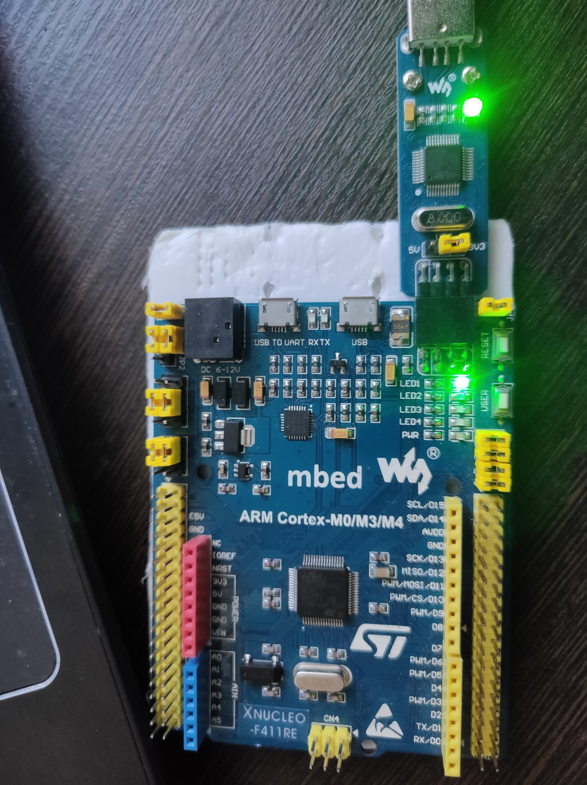
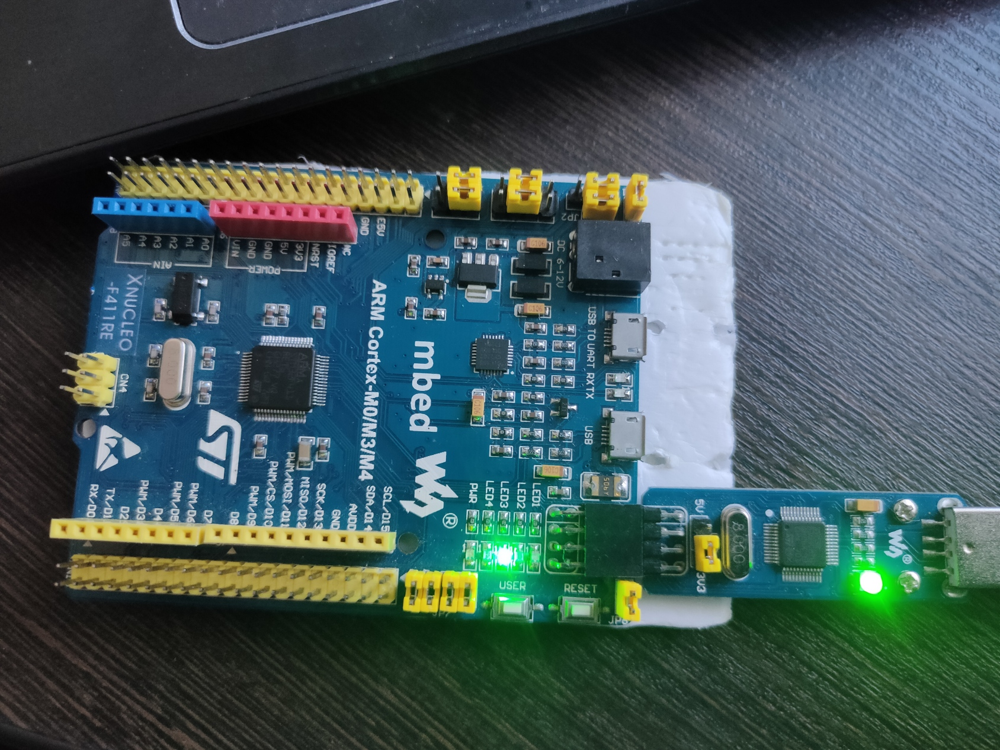
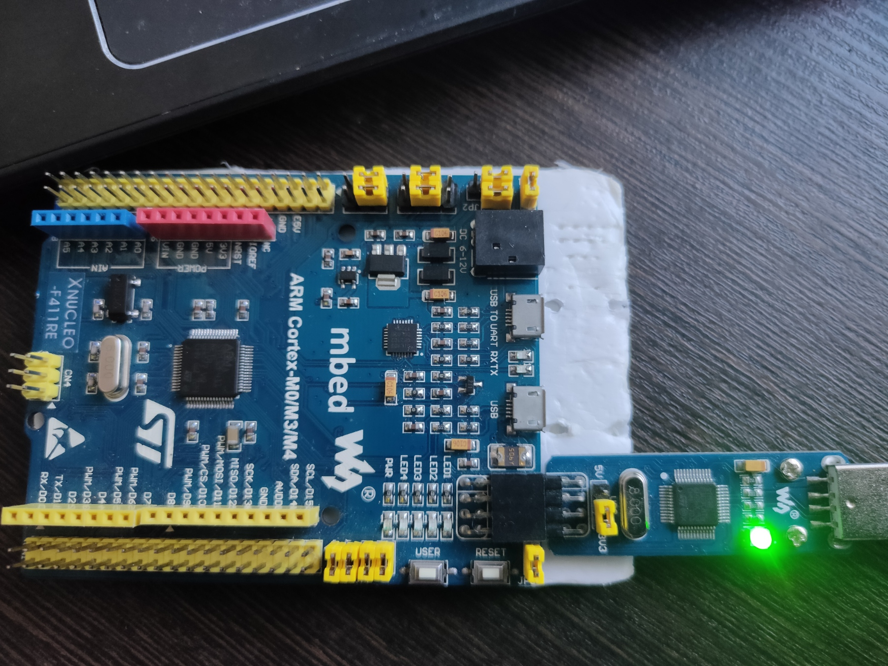

= Лабораторная №3

== Задание
** Сделать бегущий огонь из 4 светодиодов, подключенных к портам C.5, C.8, C9, A.5
* Заготовка лежит с настройками портов светодиодов лежит в https://github.com/lamer0k/stm32Labs/tree/master/Lab1
** Сделать отчет как обычно

== 1. Работа с программой

Подготовка к работе необходимо:

- Настроить проект.
- Подключить плату и убедиться, что всё работает (Что плата прошивается).

Чтобы реализовать бегущий огонь необходимо подключить библиотеки портов A и C:

[source,c]
----
#include "rccregisters.hpp" // for RCC
#include "gpioaregisters.hpp" //for Gpioa
#include "gpiocregisters.hpp" //for Gpioc
----

Код программы:

[source,c]
----
 int main()
 {
 RCC::AHB1ENR::GPIOCEN::Enable::Set(); // порт А
 RCC::AHB1ENR::GPIOAEN::Enable::Set(); // порт С
 GPIOA::MODER::MODER5::Output::Set(); // порт А - выход
 // порт С - выход
 GPIOC::MODER::MODER9::Output::Set();
 GPIOC::MODER::MODER8::Output::Set();
 GPIOC::MODER::MODER5::Output::Set();
 for(int j=0;j<1000;++j)
 {
  GPIOA::ODR::ODR5::High::Set();
  delay(1000000);
  GPIOA::ODR::ODR5::Low::Set();
  delay(1000000);
  GPIOC::ODR::ODR9::High::Set();
  delay(1000000);
  GPIOC::ODR::ODR9::Low::Set();
  delay(1000000);
  GPIOC::ODR::ODR8::High::Set();
  delay(1000000);
  GPIOC::ODR::ODR8::Low::Set();
  delay(1000000);
  GPIOC::ODR::ODR5::High::Set();
  delay(1000000);
  GPIOC::ODR::ODR5::Low::Set();
  delay(1000000);
 }
return 0;
}
----

Цикл for(;;) - цикл, который постоянно включает и выключает светодиоды с задержкой по времени.

== Выводы по работе

В программе реализован бегущий огонь с фиксируемой задержкой.

Представим ниже некоторые состояния платы.

Светодиод Led1.

Светодиод Led3.

