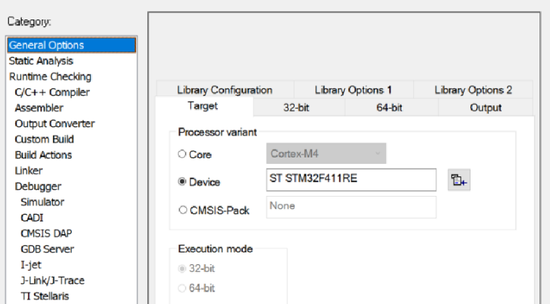
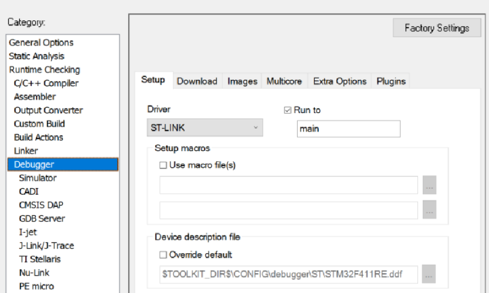

:figure-caption: Рисунок
:table-caption: Таблица
= Лабораторная №4
:toc:
:toc-title: ОГЛАВЛЕНИЕ

== Задание

. Написать программу, которая моргает всеми 4 светодиодами, но без использования магии с GPIOA::ODR::ODR5::High::Set() и тому подобное; а только прямой доступ к памяти по адресам, только хардкор.
. Описать, как работает операция ИСКЛЮЧАЮЩЕЕ ИЛИ
. Описать как поменять значения переменных местами, без привлечения третьей переменной

== Работа с программой
Выберем плату STM32F411RE

Выбрали необходиммый отладчик.

Для начала создаем таймер.
Указажем оптимизатору, чтобы он не "выкидывал" данную часть кода.

[source, c++]
int delay(int time)
{
 for (int i = 0; i < time; ++i)
 {
  asm volatile("");
 }
}

. Включаем порты на которых находятся диоды и обозначаем их как выходы.
. Прописываем поочередное включение и выключение диодов.
. Смотрим каким регисторам они соответсвует и включаем их.
. При наличии единицы в регистре диод горит, при нулевом - не горит.

[source, c++]
for(int j=0;j<1000;++j)//поскольку не рекомендуется использовать бесконечный цикл
 {
   uint32_t* ptrPaODR = reinterpret_cast<uint32_t*>(0x40020014);
   uint32_t* ptrPCODR = reinterpret_cast<uint32_t*>(0x40020814);
   *ptrPaODR ^= static_cast<uint32_t>(1 << 5);//1<<5 = 0001000
   *ptrPCODR ^= static_cast<uint32_t>(1 << 9);
   *ptrPCODR ^= static_cast<uint32_t>(1 << 8);
   *ptrPCODR ^= static_cast<uint32_t>(1 << 5);
   delay(1000000);
   *ptrPCODR ^= static_cast<uint32_t>(1 << 5);
   *ptrPCODR ^= static_cast<uint32_t>(1 << 8);
   *ptrPCODR ^= static_cast<uint32_t>(1 << 9);
   *ptrPaODR ^= static_cast<uint32_t>(1 << 5);
   delay(1000000);
 }
return 0;

Результат:

image::3.gif[]

=== Исключающее ИЛИ
Для влючения регистров используем функцию исключающего ИЛИ, которая выполняется с 2-мя битами (a и b).

* Результат выполнения операции исключающее ИЛИ равен 1, когда один из битов b или a равен 1.

* Если же b и a оба равны 0 или оба равны 1, рузультат равен 0.

Если диод был выключен (значение на регистре 0) и мы подаем 1, то он загорается, если в регистре была 1 и мы подали 1 то зачение становится равным 0.

=== Перестановка значениий переменных местами, без привлечения третьей переменной
. Существует несколько способ сделать это, один из наиболее простых это:
[source, c++]
a=3;
b=4;
b = a + b; // 4+3=7
a = b - a; // 7-3=4
b = b - a; // 7-4=3

. Способ через исключающее ИЛИ:
[source, c++]

             // X == a; Y == b
X = X XOR Y  // X == a XOR b;  Y == b
Y = X XOR Y  // X == a XOR b;  Y == b XOR (a XOR b)
X = X XOR Y  // X == (a XOR b) XOR b XOR (a XOR b);  Y == b XOR (a XOR b)

* Так как XOR ассоциативен -- перегруппируем полученные уравнения следующим образом:
[source, c++]
X == (a XOR a) XOR (b XOR b) XOR b
Y == (b XOR b) XOR a

* Так как x XOR x == 0 и x XOR 0 == x -- удалим все эти пары переменных XOR'ed с самими собой, и то, что осталось:
[source, c++]
X == b
Y == a